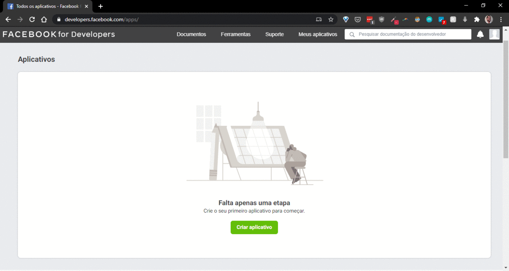
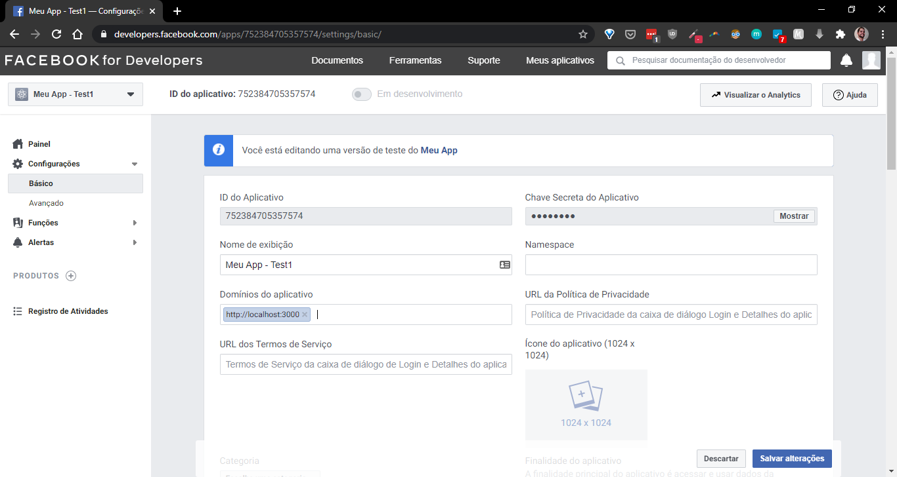
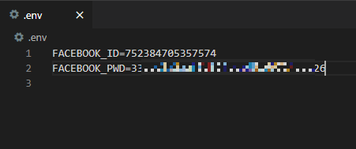

Vá em https://developers.facebook.com/apps/ e clique em `Criar Aplicativo`.

[Cheque aqui](pictures/) o passo-a-passo.

Copie o ID e a Chave Secreta e adiciona no seu `.env`.

Adicione aos `Domínios do aplicativo` o seu `http://localhost:3000`. Lembre de `Salvar alterações`.
